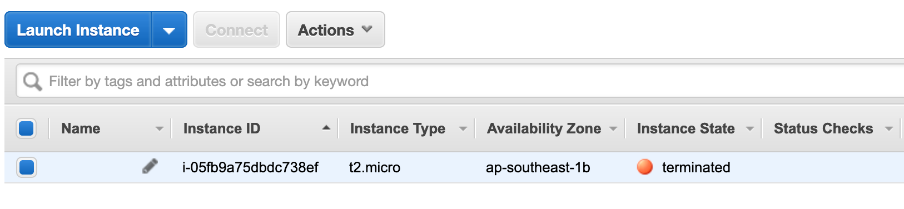

## Membangun infrastruktur sederhana 

Dengan banyaknya pilihan penyedia cloud, kita akan mulai dengan menggunakan penyedia cloud yang besar dulu dan banyak digunakan, yaitu Amazon  AWS, banyak perusahaan yang menggunakan layanan Amazon ini.

Jika belum memiliki akun AWS ini bisa mendaftarkan diri, pilih tier yang [gratis saja dulu](https://aws.amazon.com/free/). 

#### Konfigurasi

File konfigurasi terraform ini menggunakan ekstensi `.tf` , untuk AWS ini akan banyak menggunakan juga aplikasi `awscli`, yang juga bisa didownloa melalui Homebrew, dan dengan `awscli` ini kita bisa melakukan konfigurasi kredensial akun AWS, credential ini biasanya terletak di `/home/user/.aws/credentials`

Jika belum memiliki credentisl ini, bisa melakukan konfigurasi dengan perintah `$aws configure` dan isi prompt yang ditanyakan, api, secret key, region dan juga format.

Untuk api key dan secret key, bisa mengecek di akun yang anda punyai kemudian cari konfigurasi tersebut.


#### File Terraform `.tf`

File `.tf` dituliskan seperti file json komposisinya, dan berikut susunan file dari Terraform dan beberapa bagian yang digunakan.

KIta mulai dengan konfigurasi Terraform sederhana, membuat file `simple.tf`

```json
provider "aws" {
	profile = "default"
	region 	= "ap-southeast-1"
}
resource "aws_instance" "first-try" {
	ami = "ami-2757f631"
	instance_type = "t2.micro"
}
```

Untuk melihat apa saja yang dilakukan oleh file Terraform tersebut, bisa dilihat dengan melakukan perintah `$ terraform plan` .

Dari contoh script di atas, mari coba kita bahas blok-blok yang digunakan, yaitu Providers dan Resources.

##### Providers

Provider ini adalah bagian dari dimana kita akan mengeksekusi konfigurasi ini, apakah di AWS, Azure, atau lainnya.

Provider ini bertanggung jawab untuk membuat dan mengatur resource, provider sendiri adalah plugin dari Terraform, yang mana ketika menuliskan provider yang digunakan, maka Terraform akan memanggil plugin yang hanya berhubungan dengan provider yang dipilih, dan API mana yang nantinya akan dipakai oleh Terraform.

Blok konfigurasi provider ini bisa banyak dalam satu file, jadi boleh ada provider aws, azure, gcp


```
provider "aws" {
	profile = "default"
	region	= "ap-southeast-1"
}
```

or 

```
provider "google" {
	project = "seputarfinansial-app"
	region 	= "us-central"
}
```

Untuk melihat data provider bisa dilihat di [list provider](https://www.terraform.io/docs/providers/index.html) yang didukung oleh Terraform.

##### Resources

Blok `resource` ini mendefinisikan resource dari provider yang sebelumnya didefinisikan di blok provider, resource ini bisa dalam bentuk 'fisik' seperti EC2, atau juga resource lain seperti API.

Resource sendiri memiliki 2 string yang digunakan, pertama tipe dari resource yang hendak dipanggil, dan kedua nama dari resource tersebut, penamaan ini bebas-bebas saja, terserah dari yang buat, dicontoh di atas menggunakan provider `aws` lalu kemudian memanggil resource yang sesuai dengan  prefixnya, resource `aws_instance`, dan  untuk resource itu saya beri nama `first-try`.

Didalam resource ini bisi diisi dengan konfigurasi yang diinginkan, atau konfigurasi yang dibutuh kan oleh resource tersebut.

Resource sendiri bisa ditemukan di [list provider](https://www.terraform.io/docs/providers/index.html) yang didukung oleh Terraform.

##### Inisialisasi

Proses inisialisasi ini adalah perintah pertama yang dipanggil untuk file konfigurasi Terraform baru, dengan perintah `$ terraform init`

```shell
dedenf@elementium ~/hacks/terraform/00-simple (master*) $ terraform init

Initializing the backend...

Initializing provider plugins...
- Checking for available provider plugins...
- Downloading plugin for provider "aws" (hashicorp/aws) 2.44.0...

The following providers do not have any version constraints in configuration,
so the latest version was installed.

To prevent automatic upgrades to new major versions that may contain breaking
changes, it is recommended to add version = "..." constraints to the
corresponding provider blocks in configuration, with the constraint strings
suggested below.

* provider.aws: version = "~> 2.44"

Terraform has been successfully initialized!

You may now begin working with Terraform. Try running "terraform plan" to see
any changes that are required for your infrastructure. All Terraform commands
should now work.

If you ever set or change modules or backend configuration for Terraform,
rerun this command to reinitialize your working directory. If you forget, other
commands will detect it and remind you to do so if necessary.

```

Berdasarkan script `.tf` diatas, perintah argumen `init` akan mendownload plugin yang sesuai dengan apa yang dideklarasikan di file tersebut, dalam kasus ini, Terraform mendownload plugin `aws` sesuai dengan provider yang ditulis.

##### Format dan validasi

Menulis kode infrastruktur melalui Terraform file bisa terjadi inkonsistensi didalam kodenya, baik itu gaya penulisan, seperti spasi 2 atau 4, atau tab? untuk menangani itu, bisa digunakan perintah `$ terraform fmt` untuk mengecek format penulisan kode Terraform.

```shell
dedenf@elementium ~/hacks/terraform/00-simple (master*) $ terraform fmt
00-simple-aws.tf
```

Dan untuk mem-validasi kode Terraform, apakah sudah benar atau belum, lakukan perintah `$ terraform validate`

```shell
dedenf@elementium ~/hacks/terraform/00-simple (master*) $ terraform validate
Success! The configuration is valid.
```

##### Eksekusi

Setelah kita cek dan validasi, dan semuanya ok, tiba ke masanya untuk mengeksekusi file tersebut, dan melihat progressnya.

Coba kita eksekusi file tersebut

```shell
dedenf@elementium ~/hacks/terraform/00-simple (master*) $ terraform apply

An execution plan has been generated and is shown below.
Resource actions are indicated with the following symbols:
  + create

Terraform will perform the following actions:

  # aws_instance.first-try will be created
  + resource "aws_instance" "first-try" {
      + ami                          = "ami-2757f631"
      + arn                          = (known after apply)
      + associate_public_ip_address  = (known after apply)
      + availability_zone            = (known after apply)
      + cpu_core_count               = (known after apply)
      + cpu_threads_per_core         = (known after apply)
...
Plan: 1 to add, 0 to change, 0 to destroy.

Do you want to perform these actions?
  Terraform will perform the actions described above.
  Only 'yes' will be accepted to approve.

  Enter a value: yes

aws_instance.first-try: Creating...
aws_instance.first-try: Still creating... [10s elapsed]
aws_instance.first-try: Still creating... [20s elapsed]
aws_instance.first-try: Creation complete after 23s [id=i-05fb9a75dbdc738ef]

Apply complete! Resources: 1 added, 0 changed, 0 destroyed.

```

Viola! server sudah tersedia dengan konfigurasi, dan jika kita melihat dashboard AWS EC2, maka akan terlihat instance yang baru saja kita buat.


Jika terjadi kesalahan atau error, maka proses eksekusi akan berhenti, lakukan perbaikan di script-nya, di samping itu Terraform akan membuat file `terraform.tfstate` yang berisi state dari tiap-tiap langkah yang ada di script tersebut, dan kalau berhasil maka muncul status `complete` seperti di atas.

##### Menghapus infrastuktur

Untuk menghapus infrastruktur yang telah kita buat dengan script di atas, dilakukan dengan perintah argumen `destroy`

```shell
dedenf@elementium ~/hacks/terraform/00-simple (master*) $ terraform destroy
aws_instance.first-try: Refreshing state... [id=i-05fb9a75dbdc738ef]

An execution plan has been generated and is shown below.
Resource actions are indicated with the following symbols:
  - destroy

Terraform will perform the following actions:

  # aws_instance.first-try will be destroyed
  - resource "aws_instance" "first-try" {
      - ami                          = "ami-00477ca666574012f" -> null
      - arn                          = "arn:aws:ec2:ap-southeast-1:269371581377:instance/i-05fb9a75dbdc738ef" -> null
      - associate_public_ip_address  = true -> null
      - availability_zone            = "ap-southeast-1b" -> null
...
Plan: 0 to add, 0 to change, 1 to destroy.

Do you really want to destroy all resources?
  Terraform will destroy all your managed infrastructure, as shown above.
  There is no undo. Only 'yes' will be accepted to confirm.

  Enter a value: yes
```

Ketika kita masukkan konfirmasi `yes` dan enter, maka Terraform akan memulai proses menghapus instance yang ada di AWS.

Dan jika berhasil dihapus, Terraform akan menampilkan pesan berikut, 

```shell
aws_instance.first-try: Destroying... [id=i-05fb9a75dbdc738ef]
aws_instance.first-try: Still destroying... [id=i-05fb9a75dbdc738ef, 10s elapsed]
aws_instance.first-try: Still destroying... [id=i-05fb9a75dbdc738ef, 20s elapsed]
aws_instance.first-try: Still destroying... [id=i-05fb9a75dbdc738ef, 30s elapsed]
aws_instance.first-try: Destruction complete after 32s

Destroy complete! Resources: 1 destroyed.
```



Dan instance pun sudah dalam status `terminated`.

Tautan ke [contoh kode](../00-simple/)