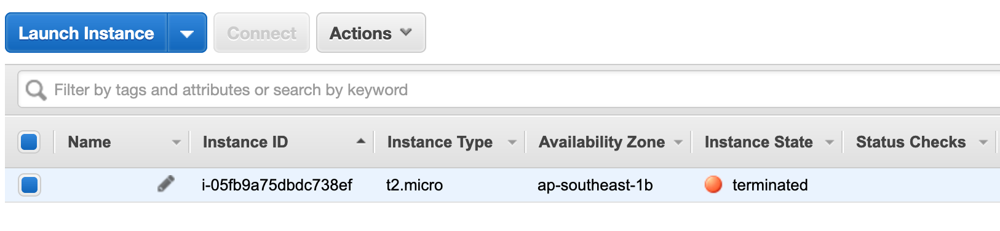

## Menghapus Infrastruktur

Pada halaman sebelumnya kita belajar membuat infra yang sederhana, memang hanya dengan membuat satu instance, sekarang kita mencoba melakukan penghapusan untuk instance.

Untuk menghapus infrastruktur yang telah kita buat dengan script sebelumnya, dilakukan dengan perintah argumen `destroy`

```shell
dedenf@elementium ~/hacks/terraform/00-simple (master*) $ terraform destroy
aws_instance.first-try: Refreshing state... [id=i-05fb9a75dbdc738ef]

An execution plan has been generated and is shown below.
Resource actions are indicated with the following symbols:
  - destroy

Terraform will perform the following actions:

  # aws_instance.first-try will be destroyed
  - resource "aws_instance" "first-try" {
      - ami                          = "ami-00477ca666574012f" -> null
      - arn                          = "arn:aws:ec2:ap-southeast-1:269371581377:instance/i-05fb9a75dbdc738ef" -> null
      - associate_public_ip_address  = true -> null
      - availability_zone            = "ap-southeast-1b" -> null
...
Plan: 0 to add, 0 to change, 1 to destroy.

Do you really want to destroy all resources?
  Terraform will destroy all your managed infrastructure, as shown above.
  There is no undo. Only 'yes' will be accepted to confirm.

  Enter a value: yes
```

Ketika kita masukkan konfirmasi `yes` dan enter, maka Terraform akan memulai proses menghapus instance yang ada di AWS.

Dan jika berhasil dihapus, Terraform akan menampilkan pesan berikut, 

```shell
aws_instance.first-try: Destroying... [id=i-05fb9a75dbdc738ef]
aws_instance.first-try: Still destroying... [id=i-05fb9a75dbdc738ef, 10s elapsed]
aws_instance.first-try: Still destroying... [id=i-05fb9a75dbdc738ef, 20s elapsed]
aws_instance.first-try: Still destroying... [id=i-05fb9a75dbdc738ef, 30s elapsed]
aws_instance.first-try: Destruction complete after 32s

Destroy complete! Resources: 1 destroyed.
```



Dan instance pun sudah dalam status `terminated`.

Tautan ke [contoh kode](../00-simple/)